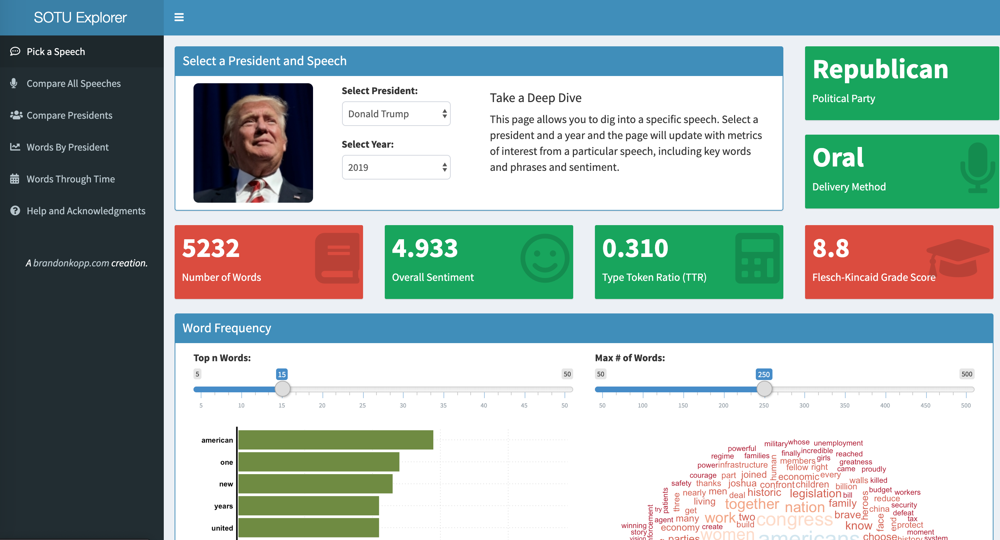

## State of the Union Address Explorer
I developed this app several years ago as a way of learning webscraping (to collect the information from various online sources), natural language processing (mostly simple things word frequencies and such), and developing applications in R Shiny. I try to add a bit to it each year. This year I used spaCy in Python to extract named entities.

I've learned a lot since I wrote the beginnings of this app. I don't know that I would do everything the same, but you're welcome to take any of this as a starting off point for your own applications. 

You can see the live application at [https://brandonkopp.shinyapps.io/sotushiny](https://brandonkopp.shinyapps.io/sotushiny)
